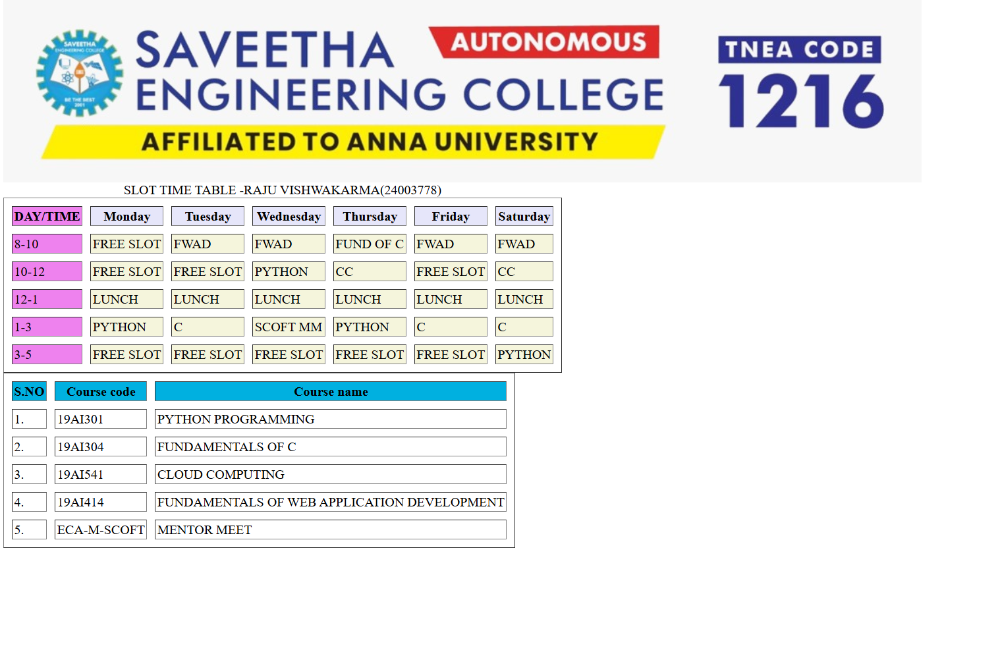

# Ex02 Time Table
# Date:04/06/2026   
# AIM
To write a html webpage page to display your slot timetable.

# ALGORITHM
## STEP 1
Create a Django-admin Interface.

## STEP 2
Create a static folder and inert HTML code.

## STEP 3
Create a simple table using `<table>` tag in html.

## STEP 4
Add header row using `<th>` tag.

## STEP 5
Add your timetable using `<td>` tag.

## STEP 6
Execute the program using runserver command.

# PROGRAM
```
tt.html

<html>
<body>
    
        <table border="1" cellspacing="10" cellpadding="2">
            <caption>SLOT TIME TABLE -RAJU VISHWAKARMA(24003778)</caption>
            <tbody><tr bgcolor="lavender">
               <th bgcolor="violet">DAY/TIME</th>
               <th>Monday</th>
               <th>Tuesday</th>
               <th>Wednesday</th>
               <th>Thursday</th>
               <th>Friday</th>
               <th>Saturday</th>
            </tr>
                <tr bgcolor="beige">
                    <td bgcolor="violet">8-10</td>
                    <td>FREE SLOT</td>
                    <td>FWAD</td>
                    <td>FWAD</td>
                    <td>FUND OF C</td>
                    <td>FWAD</td>
                    <td>FWAD</td>
                </tr>
            <tr bgcolor="beige">
                <td bgcolor="violet">10-12</td>
                <td>FREE SLOT</td>
                <td>FREE SLOT</td>
                <td>PYTHON</td>
                <td>CC</td>
                <td>FREE SLOT</td>
                <td>CC</td>
            </tr>
            <tr bgcolor="beige">
                <td bgcolor="violet">12-1</td>
                <td>LUNCH</td>
                <td>LUNCH</td>
                <td>LUNCH</td>
                <td>LUNCH</td>
                <td>LUNCH</td>
                <td>LUNCH</td>
            </tr>
            <tr bgcolor="beige">
                <td bgcolor="violet">1-3</td>
                <td>PYTHON</td>
                <td>C</td>
                <td>SCOFT MM</td>
                <td>PYTHON</td>
                <td>C</td>
                <td>C</td>
            </tr>
            <tr bgcolor="beige">
                <td bgcolor="violet">3-5</td>
                <td>FREE SLOT</td>
                <td>FREE SLOT</td>
                <td>FREE SLOT</td>
                <td>FREE SLOT</td>
                <td>FREE SLOT</td>
                <td>PYTHON</td>
            </tr>
        </tbody></table>
        <table border="1" cellspacing="10" cellpadding="2">
            <tbody><tr bgcolor="sky blue">
                <th bgcolor="sky blue">S.NO</th>
                <th>Course code</th>
                <th>Course name</th>
            </tr>
            <tr>
                <td>1.</td>
                <td>19AI301</td>
                <td>PYTHON PROGRAMMING</td>
            </tr>
            <tr>
                <td>2.</td>
                <td>19AI304</td>
                <td>FUNDAMENTALS OF C</td>
            </tr>
            <tr>
                <td>3.</td>
                <td>19AI541</td>
                <td>CLOUD COMPUTING</td>
            </tr>
            <tr>
                <td>4.</td>
                <td>19AI414</td>
                <td>FUNDAMENTALS OF WEB APPLICATION DEVELOPMENT</td>
            </tr>
            <tr>
                <td>5.</td>
                <td>ECA-M-SCOFT</td>
                <td>MENTOR MEET</td>
            </tr>
        </body></table>
    
</body></html>

```
# OUTPUT

# RESULT
The program for creating slot timetable using basic HTML tags is executed successfully.
